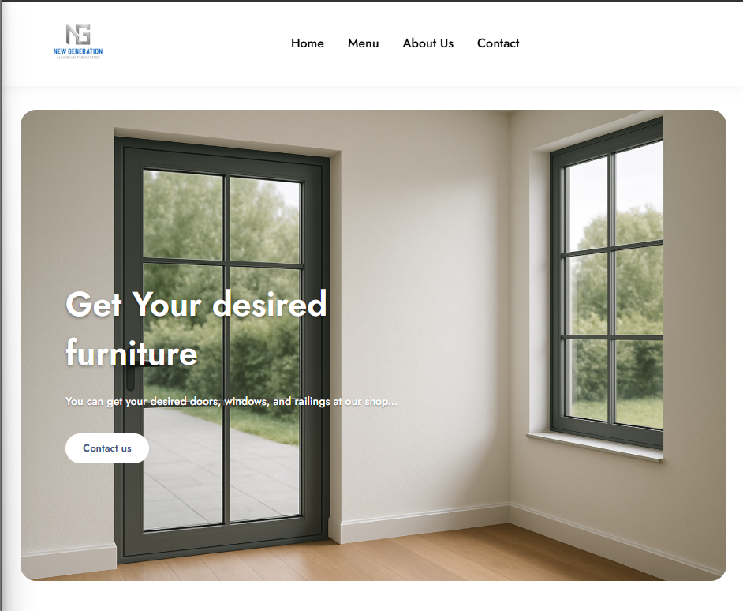
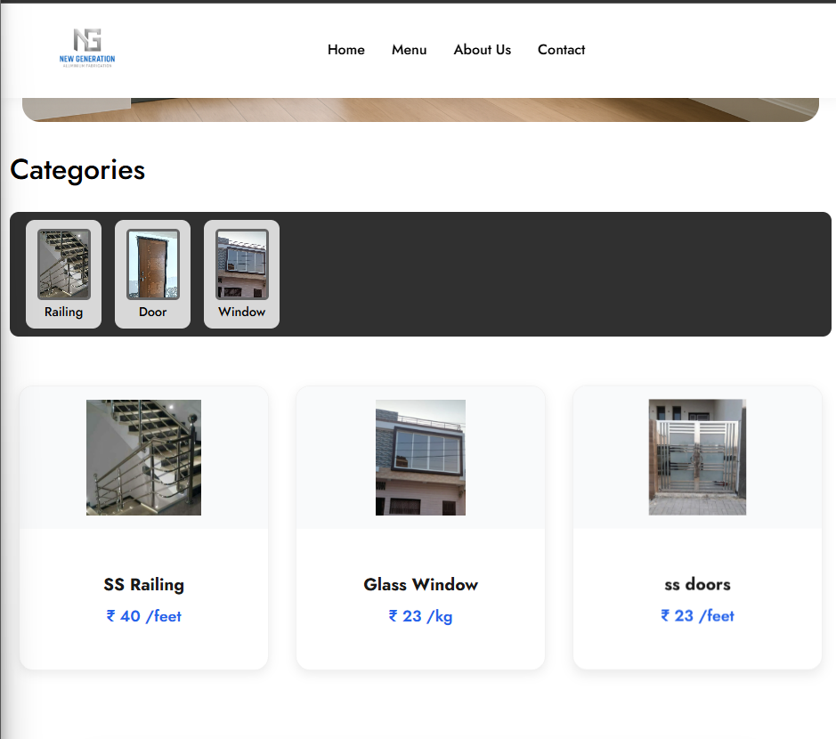
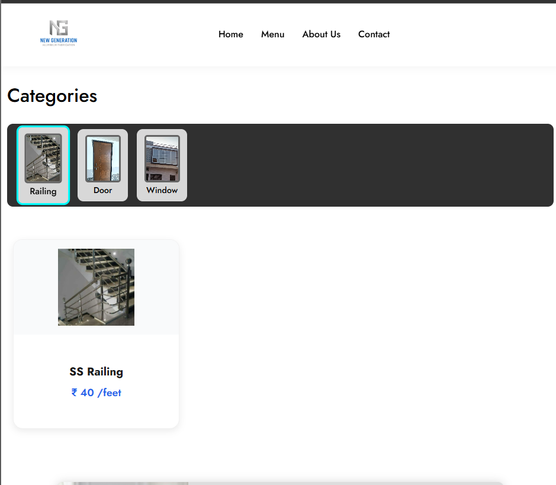
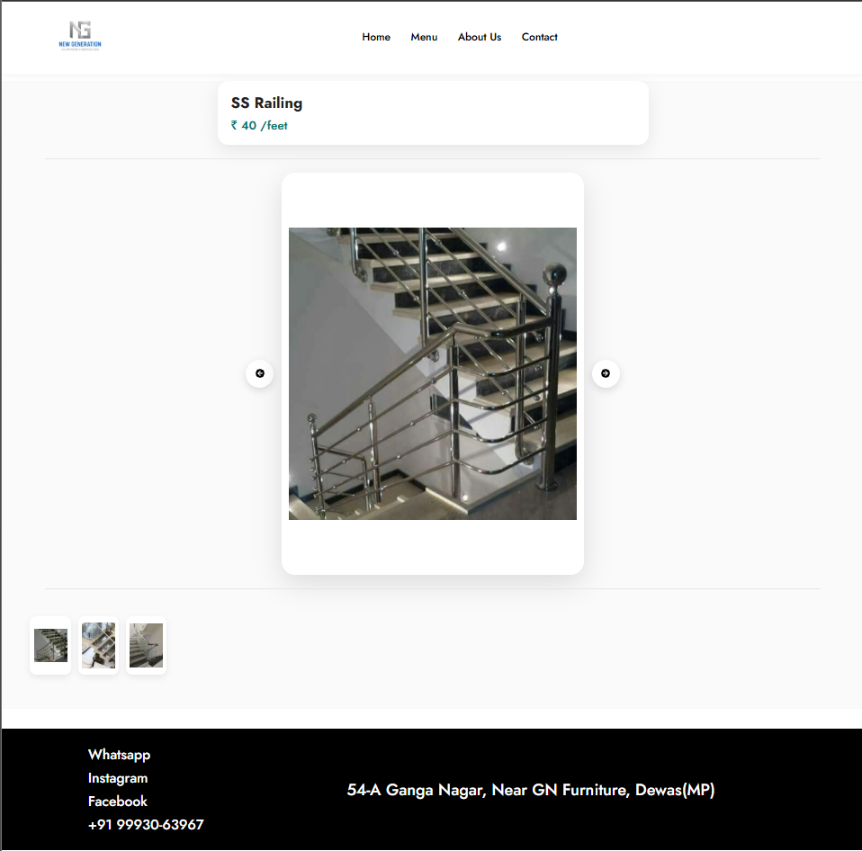
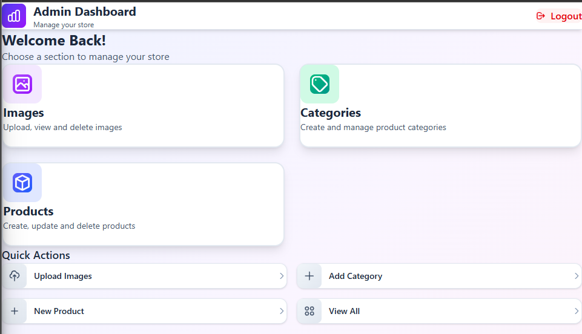
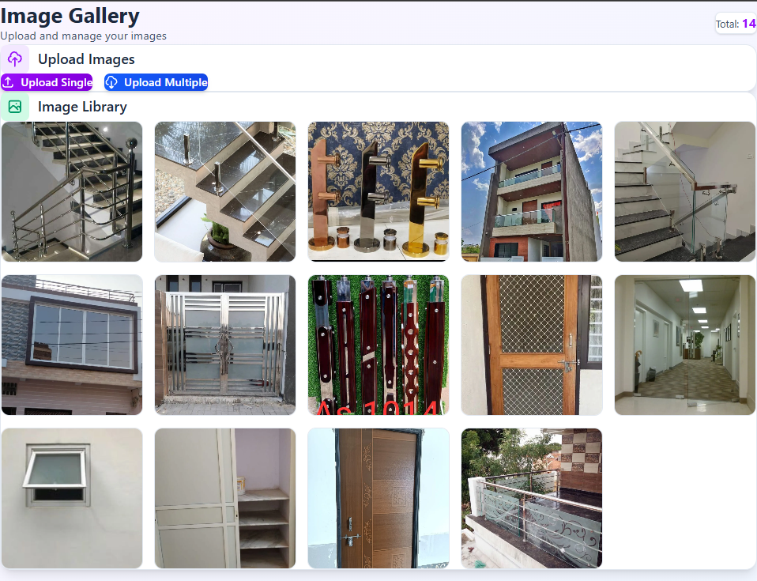
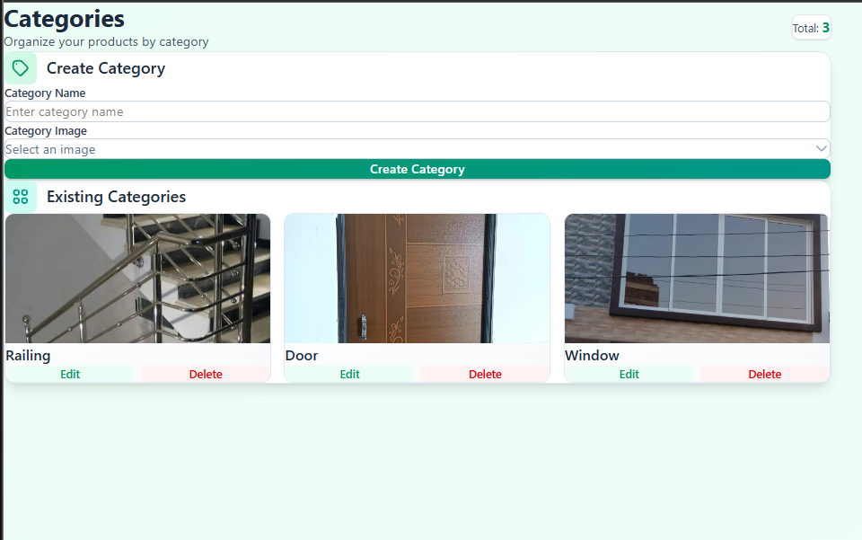
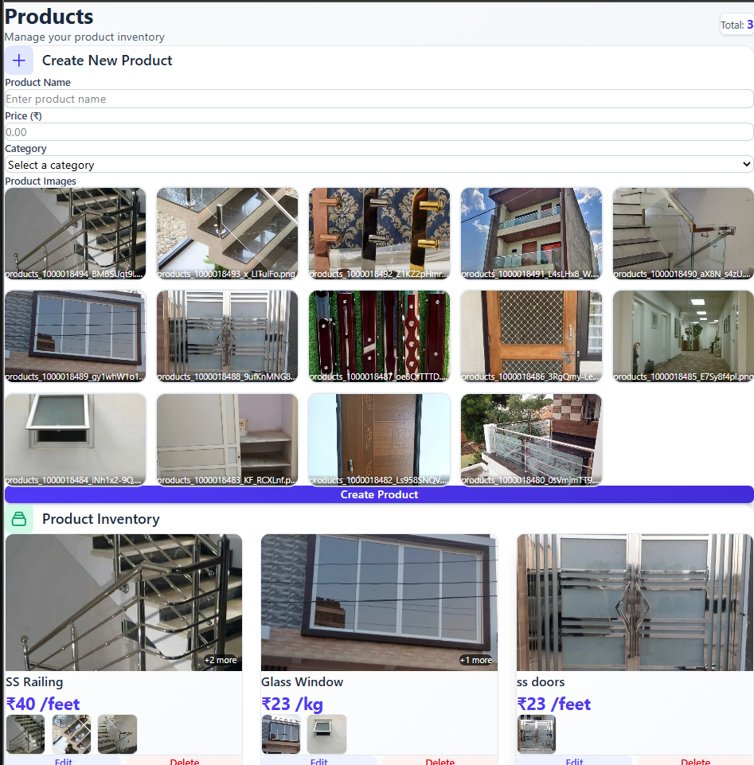

# 🛍️ NGAF – Full Stack Shop Display Platform

NGAF is a **full-stack show application** built with a modern frontend, a powerful admin dashboard, and a robust backend API.
The project focuses on **real-world architecture**, **clean UI/UX**, and **scalable backend design**.

---

## 🚀 Features

### 👤 User Side

* Browse products with **responsive image gallery** & based on **Category**
* Smooth product image navigation
* Clean and mobile-friendly UI
* Fast and intuitive user experience

### 🛠️ Admin Dashboard

* Admin-only access
* Manage products (Add / Update / Delete)
* Control product images and details
* Centralized dashboard for application data

### ⚙️ Backend

* RESTful API architecture
* Handles products, users, and admin actions
* Structured data flow between frontend and backend
* Scalable and maintainable design

---

## 📡 API Overview

| Method | Endpoint | Description |
|------|--------|------------|
| GET | /products | Fetch all products |
| GET | /products/{id} | Get product details |
| GET | /products/?category_id={id} | Get category wise product |
| POST | /products | Create product |
| PUT | /products/{id} | Update product |
| DELETE | /products/{id} | Delete product |
| GET | /categories/ | Get Categories details |
| POST | /categories/ | Create Category |
| PUT | /categories/{id} | Update Category |
| GET | /upload/images | Get all the image |
| POST | /upload/image | Upload Image |
| POST | /upload/image-bulk | Upload Images in bulk |
| DELETE | /upload/image/{id} | Delete Images |

---

## 🔐 Authentication & Authorization

- Role-based access (Admin vs User)
- Protected admin routes
- Secure API communication

---

## 🧰 Tech Stack

### Frontend

* React.js
* CSS (Responsive & Animated UI)
* Tailwind CSS (in admin frontend)
* React Router
* React Icons

### Backend

* FastAPI

### Database

* Postgresql

### Deployment

* Frontend: Vercel
* Backend: Render
* Database: Neon
* Media: Imagekit.io

---

## 📂 Project Structure

```
NGAF/
├── frontend/
│   └── src/
|      ├── api/
|      ├── assets/
|      ├── Components/
|      └── Pages/
│
├── admin-frontend/
│   └── src/
│      ├── api/
│      ├── components/
│      ├── pages/
│      └── utils/
│
├── backend/
│   ├── core/
│   ├── db/
│   ├── deps/
│   ├── routers/
│   ├── schemas/
│   ├── services/
│   ├── utils/
│   └── main.py
│
└── README.md
```

---

## 🔗 Live Demo

* 🌐 User Website: **https://new-generation-aluminium-fabricatio.vercel.app/**

---

## 🧠 What I Learned

* Building **end-to-end full stack applications**
* Designing clean and responsive UI layouts
* Handling Media
* Creating Schemas, which are self-explanotary during testing
* Handling state and dynamic image rendering in React
* Structuring scalable backend APIs
* Managing admin vs user workflows
* Real-world deployment practices

---

## 📸 Screenshots

> 
> 
> 
> 
> 
> 
> 
> 

---

## 🧑‍💻 Author

**Kartavya Sharma**
Computer Science & Engineering
Full-Stack Developer (React | FastAPI | DSA)

* GitHub: [https://github.com/kartavya21-dot]
* LinkedIn: [https://www.linkedin.com/in/kartavyasharma3/]

---

## ⭐ Acknowledgements

This project was built as a **hands-on full-stack learning experience**, focusing on real-world development practices and clean system design.

---
